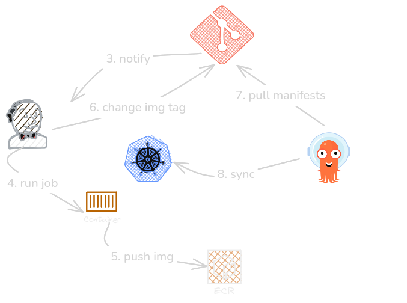

# ArgoCD Setup
Simple single endpoint http server in go for deployment testing

### Set up argocd 
#### Non Highly Available
kubectl create namespace argocd
kubectl apply -n argocd --server-side --force-conflicts -f https://raw.githubusercontent.com/argoproj/argo-cd/stable/manifests/install.yaml

#### Higly Available
kubectl create namespace argocd
kubectl apply -n argocd --server-side --force-conflicts -f https://raw.githubusercontent.com/argoproj/argo-cd/stable/manifests/ha/install.yaml

#### Simple Pipeline diagram
**Using the CI/CD setup from kon-bikas/jenkins-ecs-agents, the entire pipeline looks something like this.**
